```bash
$ sudo docker compose exec rabbitmq-$((RANDOM % 3 + 1)) \
rabbitmq-diagnostics --formatter=json cluster_status | jq .running_nodes
[
  "rabbit@rabbitmq-1",
  "rabbit@rabbitmq-2",
  "rabbit@rabbitmq-3"
]

$ for number in {1..3}; do sudo docker compose exec rabbitmq-$number \
rabbitmq-diagnostics --formatter=json status | jq .rabbitmq_version; done
"4.3.2"
"4.3.2"
"4.3.2"

$ for number in {1..3}; do sudo docker compose exec rabbitmq-$number \
rabbitmq-diagnostics --formatter=json status | jq .is_under_maintenance; done
false
false
false
```

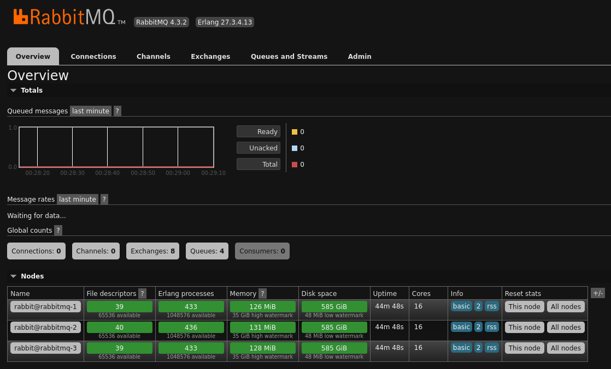

```bash
$ sudo docker compose exec rabbitmq-$((RANDOM % 3 + 1)) \
rabbitmq-diagnostics --formatter=json list_users | jq
[
  {
    "user": "admin",
    "tags": [
      "administrator"
    ]
  }
]

$ sudo docker compose exec rabbitmq-$((RANDOM % 3 + 1)) \
rabbitmq-diagnostics --formatter=json list_permissions | jq
[
  {
    "user": "admin",
    "read": ".*",
    "write": ".*",
    "configure": ".*"
  }
]

$ sudo docker compose exec rabbitmq-$((RANDOM % 3 + 1)) \
rabbitmqctl add_user user
Adding user "user" ...
|...|

$ sudo docker compose exec rabbitmq-$((RANDOM % 3 + 1)) \
rabbitmq-diagnostics --formatter=json list_users | jq
[
  {
    "user": "admin",
    "tags": [
      "administrator"
    ]
  },
  {
    "user": "user",
    "tags": []
  }
]

$ sudo docker compose exec rabbitmq-$((RANDOM % 3 + 1)) \
rabbitmqctl set_permissions user '.*' '.*' '.*'
Setting permissions for user "user" in vhost "/" ...

$ sudo docker compose exec rabbitmq-$((RANDOM % 3 + 1)) \
rabbitmq-diagnostics --formatter=json list_permissions | jq
[
  {
    "user": "admin",
    "read": ".*",
    "write": ".*",
    "configure": ".*"
  },
  {
    "user": "user",
    "read": ".*",
    "write": ".*",
    "configure": ".*"
  }
]
```

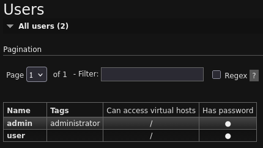

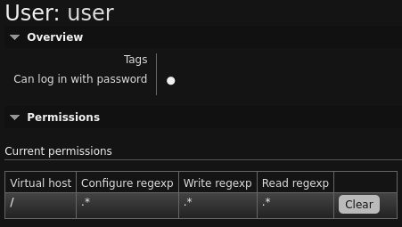

```bash
$ sudo docker compose exec rabbitmq-$((RANDOM % 3 + 1)) \
rabbitmq-diagnostics --formatter=json list_queues | jq
[
]

$ for number in {1..3}; do sudo docker compose exec rabbitmq-$number \
rabbitmqadmin --password=$(pass homeware.ovh/docker/rabbitmq/admin) --username=admin \
queues declare --name=queue-$number; done

$ sudo docker compose exec rabbitmq-$((RANDOM % 3 + 1)) \
rabbitmq-diagnostics --formatter=json list_queues | jq
[
  {
    "messages": 0,
    "name": "queue-1"
  },
  {
    "messages": 0,
    "name": "queue-2"
  },
  {
    "messages": 0,
    "name": "queue-3"
  }
]

$ sudo docker compose exec rabbitmq-$((RANDOM % 3 + 1)) \
rabbitmqadmin --password=$(pass homeware.ovh/docker/rabbitmq/admin) --username=admin \
queues declare --arguments='{"x-queue-type":"quorum"}' --name=queue

$ sudo docker compose exec rabbitmq-$((RANDOM % 3 + 1)) \
rabbitmq-diagnostics --formatter=json list_queues | jq 'sort_by(.name)'
[
  {
    "messages": 0,
    "name": "queue"
  },
  {
    "messages": 0,
    "name": "queue-1"
  },
  {
    "messages": 0,
    "name": "queue-3"
  },
  {
    "messages": 0,
    "name": "queue-2"
  }
]

$ sudo docker compose exec rabbitmq-1 \
rabbitmq-diagnostics --formatter=json list_queues --local | jq 'sort_by(.name)'
[
  {
    "messages": 0,
    "name": "queue"
  },
  {
    "messages": 0,
    "name": "queue-1"
  }
]

$ sudo docker compose exec rabbitmq-2 \
rabbitmq-diagnostics --formatter=json list_queues --local | jq 'sort_by(.name)'
[
  {
    "messages": 0,
    "name": "queue-2"
  }
]

$ sudo docker compose exec rabbitmq-3 \
rabbitmq-diagnostics --formatter=json list_queues --local | jq 'sort_by(.name)'
[
  {
    "messages": 0,
    "name": "queue-3"
  }
]

$ sudo docker compose exec rabbitmq-$((RANDOM % 3 + 1)) \
rabbitmq-diagnostics --formatter=json list_bindings |
jq 'sort_by(.destination_name)'
[
  {
    "arguments": [],
    "source_name": "",
    "source_kind": "exchange",
    "destination_name": "queue",
    "destination_kind": "queue",
    "routing_key": "queue"
  },
  {
    "arguments": [],
    "source_name": "",
    "source_kind": "exchange",
    "destination_name": "queue-1",
    "destination_kind": "queue",
    "routing_key": "queue-1"
  },
  {
    "arguments": [],
    "source_name": "",
    "source_kind": "exchange",
    "destination_name": "queue-2",
    "destination_kind": "queue",
    "routing_key": "queue-2"
  },
  {
    "arguments": [],
    "source_name": "",
    "source_kind": "exchange",
    "destination_name": "queue-3",
    "destination_kind": "queue",
    "routing_key": "queue-3"
  }
]
```

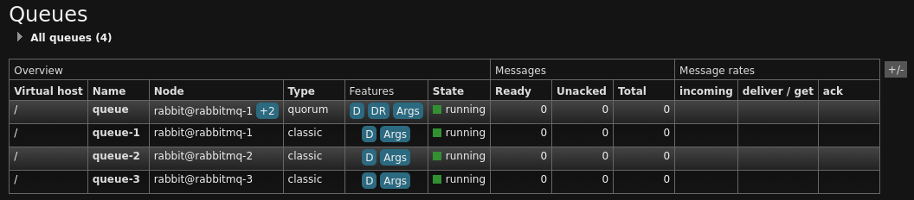

```bash
$ for number in {1..3}; do sudo docker compose exec rabbitmq-$((RANDOM % 3 + 1)) \
rabbitmqadmin --password=$(pass homeware.ovh/docker/rabbitmq/admin) \
--username=admin bindings declare --destination=queue-$number --destination-type=queue \
--routing-key=queue-$number --source=amq.direct; done

$ sudo docker compose exec rabbitmq-$((RANDOM % 3 + 1)) \
rabbitmqadmin --password=$(pass homeware.ovh/docker/rabbitmq/admin) --username=admin \
bindings declare --destination=queue --destination-type=queue --routing-key='' \
--source=amq.direct

$ sudo docker compose exec rabbitmq-$((RANDOM % 3 + 1)) \
rabbitmq-diagnostics --formatter=json list_bindings |
jq 'map(select(.source_name == "amq.direct")) | sort_by(.destination_name)'
[
  {
    "arguments": [],
    "source_name": "amq.direct",
    "source_kind": "exchange",
    "destination_name": "queue",
    "destination_kind": "queue",
    "routing_key": ""
  },
  {
    "arguments": [],
    "source_name": "amq.direct",
    "source_kind": "exchange",
    "destination_name": "queue-1",
    "destination_kind": "queue",
    "routing_key": "queue-1"
  },
  {
    "arguments": [],
    "source_name": "amq.direct",
    "source_kind": "exchange",
    "destination_name": "queue-2",
    "destination_kind": "queue",
    "routing_key": "queue-2"
  },
  {
    "arguments": [],
    "source_name": "amq.direct",
    "source_kind": "exchange",
    "destination_name": "queue-3",
    "destination_kind": "queue",
    "routing_key": "queue-3"
  }
]
```
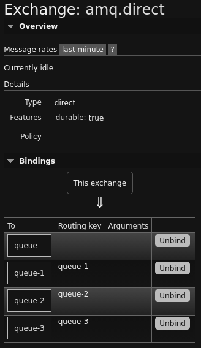

```bash
$ for number in {1..3}; do sudo docker compose exec rabbitmq-$((RANDOM % 3 + 1)) \
rabbitmqadmin --password=$(pass homeware.ovh/docker/rabbitmq/admin) \
--username=admin bindings declare --destination=queue-$number --destination-type=queue \
--routing-key=queue-$number --source=amq.fanout; done

$ sudo docker compose exec rabbitmq-$((RANDOM % 3 + 1)) \
rabbitmq-diagnostics --formatter=json list_bindings |
jq 'map(select(.source_name == "amq.fanout")) | sort_by(.destination_name)'
[
  {
    "arguments": [],
    "source_name": "amq.fanout",
    "source_kind": "exchange",
    "destination_name": "queue-1",
    "destination_kind": "queue",
    "routing_key": "queue-1"
  },
  {
    "arguments": [],
    "source_name": "amq.fanout",
    "source_kind": "exchange",
    "destination_name": "queue-2",
    "destination_kind": "queue",
    "routing_key": "queue-2"
  },
  {
    "arguments": [],
    "source_name": "amq.fanout",
    "source_kind": "exchange",
    "destination_name": "queue-3",
    "destination_kind": "queue",
    "routing_key": "queue-3"
  }
]
```

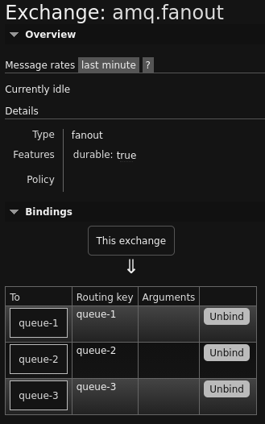


```bash
$ for number in {1..3}; do sudo docker compose exec rabbitmq-$((RANDOM % 3 + 1)) \
rabbitmqadmin --password=$(pass homeware.ovh/docker/rabbitmq/admin) \
--username=admin bindings declare --destination=queue-$number --destination-type=queue \
--routing-key=queue-$number --source=amq.topic; done

$ sudo docker compose exec rabbitmq-$((RANDOM % 3 + 1)) \
rabbitmqadmin --password=$(pass homeware.ovh/docker/rabbitmq/admin) --username=admin \
bindings declare --destination=queue --destination-type=queue --routing-key='*' \
--source=amq.topic

$ sudo docker compose exec rabbitmq-$((RANDOM % 3 + 1)) \
rabbitmq-diagnostics --formatter=json list_bindings |
jq 'map(select(.source_name == "amq.topic")) | sort_by(.destination_name)'

$ sudo docker compose exec rabbitmq-$((RANDOM % 3 + 1)) \
rabbitmq-diagnostics --formatter=json list_bindings |
jq 'map(select(.source_name == "amq.topic")) | sort_by(.destination_name)'
[
  {
    "arguments": [],
    "source_name": "amq.topic",
    "source_kind": "exchange",
    "destination_name": "queue",
    "destination_kind": "queue",
    "routing_key": "*"
  },
  {
    "arguments": [],
    "source_name": "amq.topic",
    "source_kind": "exchange",
    "destination_name": "queue-1",
    "destination_kind": "queue",
    "routing_key": "queue-1"
  },
  {
    "arguments": [],
    "source_name": "amq.topic",
    "source_kind": "exchange",
    "destination_name": "queue-2",
    "destination_kind": "queue",
    "routing_key": "queue-2"
  },
  {
    "arguments": [],
    "source_name": "amq.topic",
    "source_kind": "exchange",
    "destination_name": "queue-3",
    "destination_kind": "queue",
    "routing_key": "queue-3"
  }
]
```

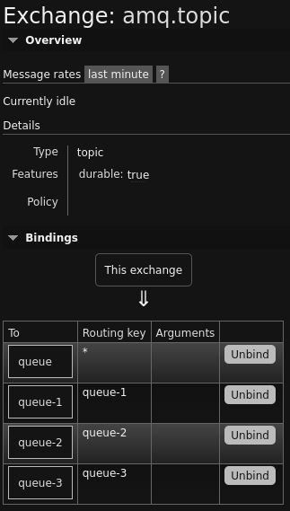

```bash
$ sudo pacman --noconfirm --noprogressbar --sync librabbitmq-c
warning: librabbitmq-c-0.16.0-1 is up to date -- reinstalling
resolving dependencies...
looking for conflicting packages...

Packages (1) librabbitmq-c-0.16.0-1

Total Installed Size:  0.38 MiB
Net Upgrade Size:      0.00 MiB

:: Proceed with installation? [Y/n]
checking keyring...
checking package integrity...
loading package files...
checking for file conflicts...
checking available disk space...
:: Processing package changes...
reinstalling librabbitmq-c...
:: Running post-transaction hooks...
(1/1) Arming ConditionNeedsUpdate...
```

```bash
$ sudo docker compose exec rabbitmq-$((RANDOM % 3 + 1)) \
rabbitmq-diagnostics --formatter=json list_queues | jq 'sort_by(.name)'
[
  {
    "messages": 0,
    "name": "queue"
  },
  {
    "messages": 0,
    "name": "queue-1"
  },
  {
    "messages": 0,
    "name": "queue-2"
  },
  {
    "messages": 0,
    "name": "queue-3"
  }
]

$ for number in {1..3}; do amqp-publish --body=message \
--cacert=/etc/ca-certificates/extracted/ca-bundle.trust.crt \
--password=$(pass homeware.ovh/docker/rabbitmq/user) --routing-key=queue-$number \
--server=rabbitmq.homeware.ovh --ssl --username=user; done

$ sudo docker compose exec rabbitmq-$((RANDOM % 3 + 1)) \
rabbitmq-diagnostics --formatter=json list_queues | jq 'sort_by(.name)'
[
  {
    "messages": 1,
    "name": "queue"
  },
  {
    "messages": 1,
    "name": "queue-1"
  },
  {
    "messages": 1,
    "name": "queue-2"
  },
  {
    "messages": 1,
    "name": "queue-3"
  }
]
```

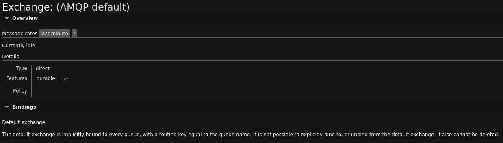

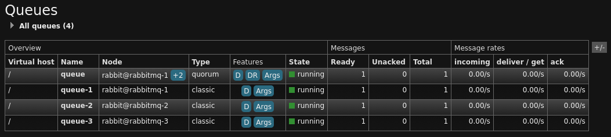

```bash
$ for number in {1..3}; do amqp-get --cacert=/etc/ca-certificates/extracted/ca-bundle.trust.crt \
--password=$(pass homeware.ovh/docker/rabbitmq/user) --queue=queue-$number \
--server=rabbitmq.homeware.ovh --ssl --username=user && echo; done
message
message
message

$ amqp-get --cacert=/etc/ca-certificates/extracted/ca-bundle.trust.crt \
--password=$(pass homeware.ovh/docker/rabbitmq/user) --queue=queue \
--server=rabbitmq.homeware.ovh --ssl --username=user && echo
message
```


```bash
$ for number in {1..3}; do amqp-publish --body=message \
--cacert=/etc/ca-certificates/extracted/ca-bundle.trust.crt --exchange=amq.direct \
--password=$(pass homeware.ovh/docker/rabbitmq/user) --routing-key=queue-$number \
--server=rabbitmq.homeware.ovh --ssl --username=user; done

$ amqp-publish --body=message --cacert=/etc/ca-certificates/extracted/ca-bundle.trust.crt \
--exchange=amq.direct --password=$(pass homeware.ovh/docker/rabbitmq/user) \
--routing-key='' --server=rabbitmq.homeware.ovh --ssl --username=user

$ sudo docker compose exec rabbitmq-$((RANDOM % 3 + 1)) \
rabbitmq-diagnostics --formatter=json list_queues | jq 'sort_by(.name)'
[
  {
    "messages": 1,
    "name": "queue"
  },
  {
    "messages": 1,
    "name": "queue-1"
  },
  {
    "messages": 1,
    "name": "queue-2"
  },
  {
    "messages": 1,
    "name": "queue-3"
  }
]
```


```bash
$ for number in {1..3}; do amqp-get --cacert=/etc/ca-certificates/extracted/ca-bundle.trust.crt \
--password=$(pass homeware.ovh/docker/rabbitmq/user) --queue=queue-$number \
--server=rabbitmq.homeware.ovh --ssl --username=user && echo; done
message
message
message

$ amqp-get --cacert=/etc/ca-certificates/extracted/ca-bundle.trust.crt \
--password=$(pass homeware.ovh/docker/rabbitmq/user) --queue=queue \
--server=rabbitmq.homeware.ovh --ssl --username=user && echo
message
```


```bash
$ amqp-publish --body=message --cacert=/etc/ca-certificates/extracted/ca-bundle.trust.crt \
--exchange=amq.fanout --password=$(pass homeware.ovh/docker/rabbitmq/user) \
--server=rabbitmq.homeware.ovh --ssl --username=user

$ sudo docker compose exec rabbitmq-$((RANDOM % 3 + 1)) \
rabbitmq-diagnostics --formatter=json list_queues | jq 'sort_by(.name)'
[
  {
    "messages": 0,
    "name": "queue"
  },
  {
    "messages": 1,
    "name": "queue-1"
  },
  {
    "messages": 1,
    "name": "queue-2"
  },
  {
    "messages": 1,
    "name": "queue-3"
  }
]
```


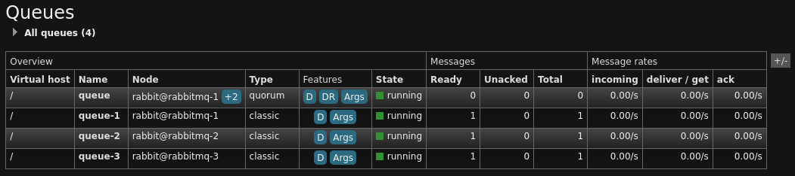

```bash
$ for number in {1..3}; do amqp-get --cacert=/etc/ca-certificates/extracted/ca-bundle.trust.crt \
--password=$(pass homeware.ovh/docker/rabbitmq/user) --queue=queue-$number \
--server=rabbitmq.homeware.ovh --ssl --username=user && echo; done
message
message
message
```


```bash
$ for number in {1..3}; do amqp-publish --body=message \
--cacert=/etc/ca-certificates/extracted/ca-bundle.trust.crt --exchange=amq.topic \
--password=$(pass homeware.ovh/docker/rabbitmq/user) --routing-key=queue-$number \
--server=rabbitmq.homeware.ovh --ssl --username=user; done

$ amqp-publish --body=message --cacert=/etc/ca-certificates/extracted/ca-bundle.trust.crt \
--exchange=amq.topic --password=$(pass homeware.ovh/docker/rabbitmq/user) \
--routing-key=none --server=rabbitmq.homeware.ovh --ssl --username=user

$ amqp-publish --body=message --cacert=/etc/ca-certificates/extracted/ca-bundle.trust.crt \
--exchange=amq.topic --password=$(pass homeware.ovh/docker/rabbitmq/user) \
--routing-key='' --server=rabbitmq.homeware.ovh --ssl --username=user

$ sudo docker compose exec rabbitmq-$((RANDOM % 3 + 1)) \
rabbitmq-diagnostics --formatter=json list_queues | jq 'sort_by(.name)'
[
  {
    "messages": 4,
    "name": "queue"
  },
  {
    "messages": 1,
    "name": "queue-1"
  },
  {
    "messages": 1,
    "name": "queue-2"
  },
  {
    "messages": 1,
    "name": "queue-3"
  }
]
```


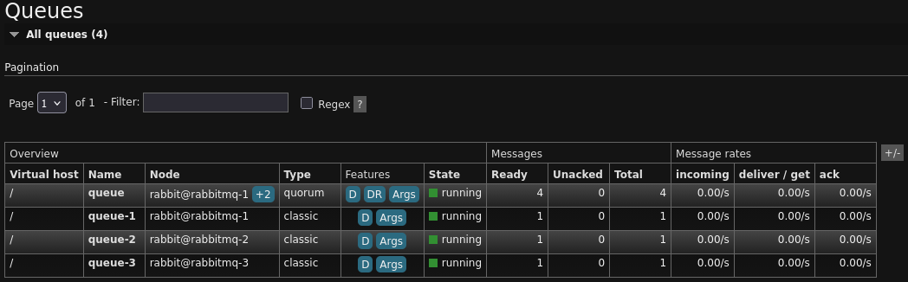


```bash
$ for number in {1..3}; do amqp-get --cacert=/etc/ca-certificates/extracted/ca-bundle.trust.crt \
--password=$(pass homeware.ovh/docker/rabbitmq/user) --queue=queue-$number \
--server=rabbitmq.homeware.ovh --ssl --username=user && echo; done
message
message
message

$ amqp-consume --cacert=/etc/ca-certificates/extracted/ca-bundle.trust.crt --count=4 \
--password=$(pass homeware.ovh/docker/rabbitmq/user) --queue=queue \
--server=rabbitmq.homeware.ovh --ssl --username=user cat && echo
messagemessagemessagemessage
```


